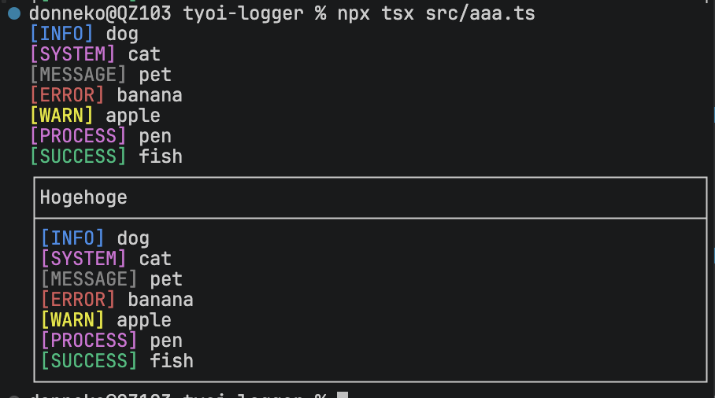

# @donneko/tyoi-logger



**Easily create a log**
> Warning: in development

## Quick start

```JavaScript
import { Logger } from "@donneko/tyoi-logger";

const log = new Logger();


log.info("dog");     // [INFO] dog
log.system("cat");   // [SYSTEM] cat
log.message("pet");  // [MESSAGE] pet
log.error("banana"); // [ERROR] banana
log.warn("apple");   // [WARN] apple
log.process("pen");  // [PROCESS] pen
log.success("fish"); // [SUCCESS] fish

log.window(
    title:"Hogehoge",
    content:[
        log.createInfo("dog"),     // [INFO] dog
        log.createSystem("cat"),   // [SYSTEM] cat
        log.createMessage("pet"),  // [MESSAGE] pet
        log.createError("banana"), // [ERROR] banana
        log.createWarn("apple"),   // [WARN] apple
        log.createProcess("pen"),  // [PROCESS] pen
        log.createSuccess("fish"), // [SUCCESS] fish
    ]
);

```