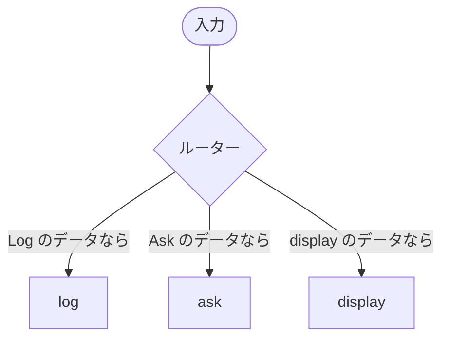
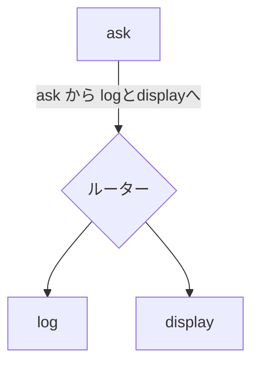
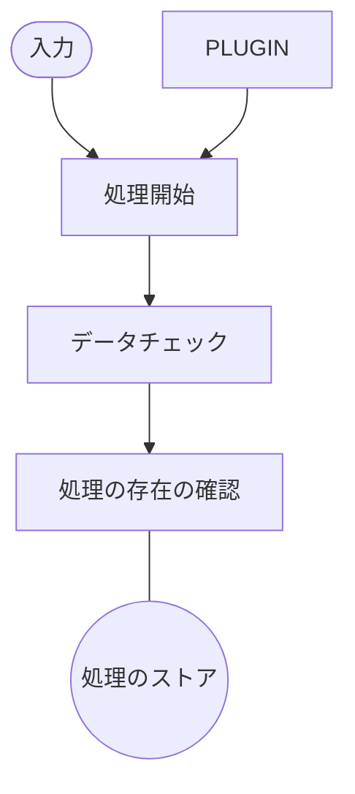

# フローチャート

## ルーター

### ルータのデータの動き

#### Input から 各処理へ

```mermaid
flowchart TB
    INPUT([入力])-->ROUTER{ルーター}
    ROUTER-- Log のデータなら -->LOG[log]
    ROUTER-- Ask のデータなら -->ASK[ask]
    ROUTER-- display のデータなら -->DIS[display]
```

#### 処理 から 処理へ

```mermaid
flowchart TB
    ROUTER{ルーター}
    LOG[log]
    ASK[ask]
    DIS[display]
    ASK-- ask から logとdisplayへ --> ROUTER
    ROUTER -->LOG
    ROUTER -->DIS
```

### ルータ内部の動き

#### Input から 処理へ

```mermaid
flowchart TB
    INPUT([入力])
    PLUGIN_DATA((処理のストア))

    ROUTER_START[処理開始]

    INPUT-->ROUTER_START
    PLUGIN-->ROUTER_START

    VALIDATION[データチェック]

    ROUTER_START --> VALIDATION

    DATA_CHECK[処理の存在の確認]

    DATA_CHECK --- PLUGIN_DATA
    VALIDATION-->DATA_CHECK
```
